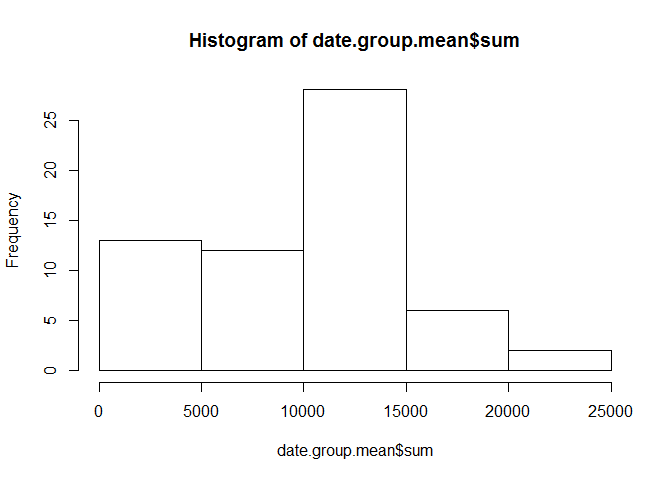
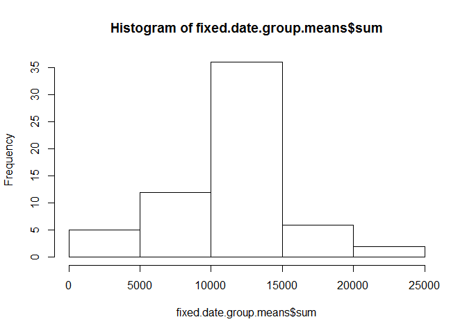
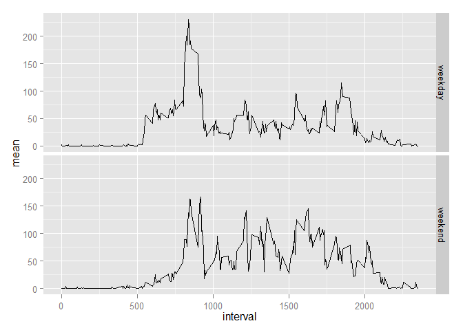

# Reproducible Research: Peer Assessment 1


This document completes Peer Assessment #1.

### Load up some necessary packages


```r
library(dplyr)
```

```
## 
## Attaching package: 'dplyr'
## 
## The following objects are masked from 'package:stats':
## 
##     filter, lag
## 
## The following objects are masked from 'package:base':
## 
##     intersect, setdiff, setequal, union
```

```r
library(ggplot2)
```

### First section - Loading and preprocessing the data


1. Load the data


```r
setwd("C:/Users/rrreuter/Google Drive/DataScienceClass/Class5_reproducible research")
data <- read.csv("./activity.csv")
```

Basic summary of the raw data:
        

```r
summary(data)
```

```
##      steps                date          interval     
##  Min.   :  0.00   2012-10-01:  288   Min.   :   0.0  
##  1st Qu.:  0.00   2012-10-02:  288   1st Qu.: 588.8  
##  Median :  0.00   2012-10-03:  288   Median :1177.5  
##  Mean   : 37.38   2012-10-04:  288   Mean   :1177.5  
##  3rd Qu.: 12.00   2012-10-05:  288   3rd Qu.:1766.2  
##  Max.   :806.00   2012-10-06:  288   Max.   :2355.0  
##  NA's   :2304     (Other)   :15840
```


### Mean steps
An interesting thing to know about this dataset is something about the normal number of steps taken per day.

The mean and median steps per day are:


```r
date.group <- group_by(data, date)
date.group.mean <- summarise(date.group, 
        mean = mean(steps, na.rm=TRUE),
        median = median(steps, na.rm=TRUE),
        sum = sum(steps, na.rm=TRUE))
```

A histogram of total steps per day:

```r
hist(date.group.mean$sum)
```

 


### Activity patterns
Understanding activity patterns might be useful too.  So we can plot the activity over the day (averaged across all days), and look for the maximum activity.


```r
interval.group <- group_by(data, interval)
interval.group.means <- summarise(interval.group, 
                                mean = mean(steps, na.rm=TRUE))
plot(mean ~ interval, data=interval.group.means, type="l")
```

 

The interval of the the day with the maximum activity can be found:


```r
interval.group.means[which.max(interval.group.means$mean), ]
```

```
## Source: local data frame [1 x 2]
## 
##     interval     mean
## 104      835 206.1698
```

###Missing values
There are several instances of missing values in this dataset.  


```r
sum(is.na(data))
```

```
## [1] 2304
```

To begin investigating if these missing values may impart any bias into the analysis, the mean value for the time interval is substitued for the NAs.


```r
fixed.data <- data
fixed.data.merge <- merge(fixed.data, interval.group.means)
for (i in 1:(length(fixed.data.merge$steps))) {
        
        if (is.na(fixed.data.merge$steps[i])) {
                fixed.data.merge$steps[i] <- fixed.data.merge$mean[i]
        }

}

sum(is.na(fixed.data.merge))
```

```
## [1] 0
```

Re-calculating the mean and median steps for each day now contrasts with what was calculated on the raw data prior.

```r
fixed.date.group <- group_by(fixed.data.merge, date)
fixed.date.group.means <- summarise(fixed.date.group, 
        mean = mean(steps, na.rm=TRUE),
        median = median(steps, na.rm=TRUE),
        sum = sum(steps, na.rm=TRUE))
fixed.date.group.means
```

```
## Source: local data frame [61 x 4]
## 
##          date       mean   median      sum
## 1  2012-10-01 37.3825996 34.11321 10766.19
## 2  2012-10-02  0.4375000  0.00000   126.00
## 3  2012-10-03 39.4166667  0.00000 11352.00
## 4  2012-10-04 42.0694444  0.00000 12116.00
## 5  2012-10-05 46.1597222  0.00000 13294.00
## 6  2012-10-06 53.5416667  0.00000 15420.00
## 7  2012-10-07 38.2465278  0.00000 11015.00
## 8  2012-10-08 37.3825996 34.11321 10766.19
## 9  2012-10-09 44.4826389  0.00000 12811.00
## 10 2012-10-10 34.3750000  0.00000  9900.00
## 11 2012-10-11 35.7777778  0.00000 10304.00
## 12 2012-10-12 60.3541667  0.00000 17382.00
## 13 2012-10-13 43.1458333  0.00000 12426.00
## 14 2012-10-14 52.4236111  0.00000 15098.00
## 15 2012-10-15 35.2048611  0.00000 10139.00
## 16 2012-10-16 52.3750000  0.00000 15084.00
## 17 2012-10-17 46.7083333  0.00000 13452.00
## 18 2012-10-18 34.9166667  0.00000 10056.00
## 19 2012-10-19 41.0729167  0.00000 11829.00
## 20 2012-10-20 36.0937500  0.00000 10395.00
## 21 2012-10-21 30.6284722  0.00000  8821.00
## 22 2012-10-22 46.7361111  0.00000 13460.00
## 23 2012-10-23 30.9652778  0.00000  8918.00
## 24 2012-10-24 29.0104167  0.00000  8355.00
## 25 2012-10-25  8.6527778  0.00000  2492.00
## 26 2012-10-26 23.5347222  0.00000  6778.00
## 27 2012-10-27 35.1354167  0.00000 10119.00
## 28 2012-10-28 39.7847222  0.00000 11458.00
## 29 2012-10-29 17.4236111  0.00000  5018.00
## 30 2012-10-30 34.0937500  0.00000  9819.00
## 31 2012-10-31 53.5208333  0.00000 15414.00
## 32 2012-11-01 37.3825996 34.11321 10766.19
## 33 2012-11-02 36.8055556  0.00000 10600.00
## 34 2012-11-03 36.7048611  0.00000 10571.00
## 35 2012-11-04 37.3825996 34.11321 10766.19
## 36 2012-11-05 36.2465278  0.00000 10439.00
## 37 2012-11-06 28.9375000  0.00000  8334.00
## 38 2012-11-07 44.7326389  0.00000 12883.00
## 39 2012-11-08 11.1770833  0.00000  3219.00
## 40 2012-11-09 37.3825996 34.11321 10766.19
## 41 2012-11-10 37.3825996 34.11321 10766.19
## 42 2012-11-11 43.7777778  0.00000 12608.00
## 43 2012-11-12 37.3784722  0.00000 10765.00
## 44 2012-11-13 25.4722222  0.00000  7336.00
## 45 2012-11-14 37.3825996 34.11321 10766.19
## 46 2012-11-15  0.1423611  0.00000    41.00
## 47 2012-11-16 18.8923611  0.00000  5441.00
## 48 2012-11-17 49.7881944  0.00000 14339.00
## 49 2012-11-18 52.4652778  0.00000 15110.00
## 50 2012-11-19 30.6979167  0.00000  8841.00
## 51 2012-11-20 15.5277778  0.00000  4472.00
## 52 2012-11-21 44.3993056  0.00000 12787.00
## 53 2012-11-22 70.9270833  0.00000 20427.00
## 54 2012-11-23 73.5902778  0.00000 21194.00
## 55 2012-11-24 50.2708333  0.00000 14478.00
## 56 2012-11-25 41.0902778  0.00000 11834.00
## 57 2012-11-26 38.7569444  0.00000 11162.00
## 58 2012-11-27 47.3819444  0.00000 13646.00
## 59 2012-11-28 35.3576389  0.00000 10183.00
## 60 2012-11-29 24.4687500  0.00000  7047.00
## 61 2012-11-30 37.3825996 34.11321 10766.19
```

```r
hist(fixed.date.group.means$sum)
```

 

Imputing the missing data removed the NAs from the data set, which make the distribution of total steps per day much more normally shaped. 

###Weekday effects on activity
Type of day may affect activity.  To investigate, a variable is created to denote type of day.


```r
type.data <- fixed.data.merge
type.data$date <- as.Date(type.data$date)
type.data$day <- weekdays(type.data$date)
type.data$day.type <- "weekday"
for (i in 1:(length(type.data$day))) {
        if (type.data$day[i] == "Saturday") {
                type.data$day.type[i] <- "weekend"
}
}
for (i in 1:(length(type.data$day))) {
        if (type.data$day[i] == "Sunday") {
                type.data$day.type[i] <- "weekend"
}
}
```

Then a plot of the activity in weekday vs. weekends can be created to illustrate that the activity pattern is dependent on the day type; activity is greater early in the day on weekdays.


```r
type.group <- group_by(type.data, interval, day.type)
type.group.means <- summarise(type.group, 
                                mean = mean(steps, na.rm=TRUE))
ggplot(type.group.means, aes(y=mean, x=interval)) + geom_line(shape=1) + facet_grid(day.type ~ .)
```

 
